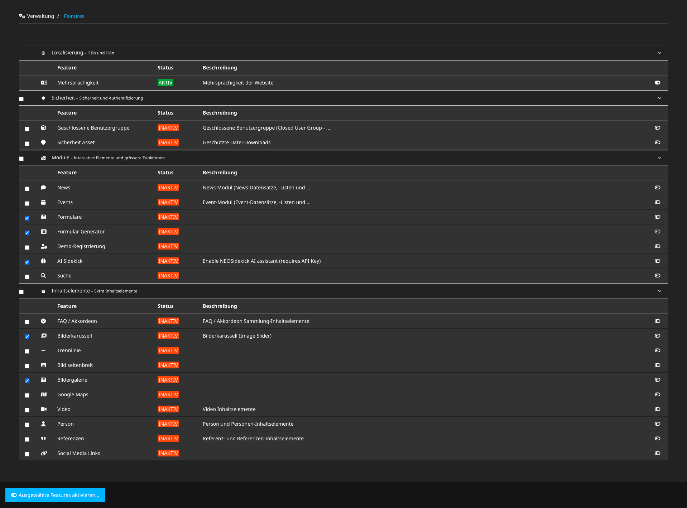

# Features for Neos

[Neos](https://neos.io) package providing a feature system including a backend module to activate, configure and deactivate global features of an installation

<a href="screenshot.png" target="_blank"></a>

## How it works

* Features are **declared** in `Settings.yaml` with an id, name, description, icon and optional group and dependencies
* Each feature is backed by a **PHP implementation** that reacts to the feature lifecycle (`activate` / `updateOptions` / `deactivate`) – for example by writing overrides to the dedicated `Settings.Features.yaml` and `NodeTypes.Features.yaml` configuration files
* Feature **states** (active flag and configured options) are stored in a YAML file underneath the `Data/` folder
* Features can **depend on each other**: dependencies are activated along with a feature (in the correct order) and a feature cannot be deactivated while active features still depend on it
* Relevant **caches are flushed** automatically whenever a feature state changes

# Usage

1. Install the package via composer:

```shell
composer require wwwision/neos-features
```

2. Grant access to the backend module to the corresponding roles via `Policy.yaml`:

```yaml
roles:
  'Neos.Neos:Administrator':
    privileges:
      - privilegeTarget: 'Wwwision.Neos.Features.Module:FeaturesModule'
        permission: GRANT
```

3. Declare a first feature via `Settings.yaml`:

```yaml
Wwwision:
  Neos:
    Features:
      features:
        'dark-mode':
          name: 'Dark mode'
          description: 'Enables the dark theme in the site frontend'
          icon: 'moon'
```

> [!NOTE]
> A feature that declares neither an `objectName` nor a `factoryClassName` is a *noop feature*: activating it merely records the state without further side effects.
> See [Feature implementations](#feature-implementations) below for features that actually do something.

4. Navigate to the new backend module

Log in as Neos administrator and navigate to the new "Features" module underneath the "Administration" main module, or head straight to `/neos/administration/features`

# Declaring features

Features and feature groups are declared underneath the `Wwwision.Neos.Features` settings:

```yaml
Wwwision:
  Neos:
    Features:
      featureGroups:
        'marketing':
          name: 'Marketing'
          description: 'Marketing & tracking related features'
          icon: 'bullhorn'
      features:
        'maintenance-mode':
          name: 'Maintenance mode'
          description: 'Shows a maintenance page to visitors'
          icon: 'wrench'
          objectName: 'Some\Package\Features\MaintenanceModeFeature'
        'testimonials':
          name: 'Testimonial documents'
          description: 'Allows editors to create testimonial pages'
          icon: 'quote-right'
          group: 'marketing'
          factoryClassName: 'Wwwision\Neos\Features\Model\CommonFeatures\ActivateNodeTypeFeatureFactory'
          options:
            nodeType: 'Some.Package:Document.Testimonial'
        'testimonial-carousel':
          name: 'Testimonial carousel'
          description: 'Renders a carousel of testimonials on the homepage'
          group: 'marketing'
          dependsOn: ['testimonials']
```

Every feature supports the following settings:

* `name` – label displayed in the backend module (defaults to the feature id)
* `description` – optional description displayed in the backend module
* `icon` – optional [Font Awesome](https://fontawesome.com/v5/search) icon name
* `group` – optional id of a group declared underneath `featureGroups`
* `dependsOn` – optional list of feature ids this feature depends on
* `position` – optional position of the feature within its group, supporting the usual `start`/`end`/`before <id>`/`after <id>` syntax
* `objectName` – optional class name of a [feature implementation](#feature-implementations)
* `factoryClassName` – optional class name of a [feature factory](#feature-factories) (mutually exclusive with `objectName`)
* `options` – optional *factory options*, only allowed in combination with `factoryClassName`

The dependency graph is validated eagerly: unknown `dependsOn` references, dependency cycles and unknown `group` references all fail at load time with a corresponding exception.

# Feature implementations

The behavior of a feature is provided by a PHP class implementing one of two interfaces:

* `OptionlessFeatureImplementation` – for features without configuration: `activate(context)` / `deactivate(context)`
* `ConfigurableFeatureImplementation` – for features with typed options: `activate(context, options)` / `updateOptions(context, previous, new)` / `deactivate(context, previousOptions)`

## Optionless features

The following example enables/disables a (fictional) dark mode setting of the site package by writing to the shared [settings file](#the-feature-context):

```php
<?php

declare(strict_types=1);

namespace Some\Package\Features;

use Wwwision\Neos\Features\Model\Feature\FeatureActivateResult;
use Wwwision\Neos\Features\Model\Feature\FeatureDeactivateResult;
use Wwwision\Neos\Features\Model\FeatureImplementation\FeatureContext;
use Wwwision\Neos\Features\Model\FeatureImplementation\OptionlessFeatureImplementation;

final readonly class DarkModeFeature implements OptionlessFeatureImplementation
{
    public function activate(FeatureContext $context): FeatureActivateResult
    {
        $context->settingsFile()->set(['Some', 'Package', 'darkMode', 'enabled'], true);
        return FeatureActivateResult::success();
    }

    public function deactivate(FeatureContext $context): FeatureDeactivateResult
    {
        $context->settingsFile()->unset(['Some', 'Package', 'darkMode', 'enabled']);
        return FeatureDeactivateResult::success();
    }
}
```

## Configurable features

A configurable feature declares a class implementing the `FeatureOptions` marker interface. Its constructor signature defines the schema of the activation/update form in the backend module (rendered via [wwwision/types](https://github.com/bwaidelich/types)):

```php
<?php

declare(strict_types=1);

namespace Some\Package\Features;

use Neos\Flow\Annotations as Flow;
use Wwwision\Neos\Features\Model\Feature\FeatureOptions;

#[Flow\Proxy(false)]
final readonly class MaintenanceModeOptions implements FeatureOptions
{
    public function __construct(
        public string $message,
        public bool $allowBackendUsers = true,
    ) {}
}
```

> [!IMPORTANT]
> Options classes have to be annotated with `#[Flow\Proxy(false)]` – otherwise Flow will replace them with a generated proxy class, breaking the reflection-based extraction of the options schema that the form rendering and (de)serialization rely on

The corresponding implementation receives the configured options in its lifecycle methods:

```php
<?php

declare(strict_types=1);

namespace Some\Package\Features;

use Wwwision\Neos\Features\Model\Feature\FeatureActivateResult;
use Wwwision\Neos\Features\Model\Feature\FeatureDeactivateResult;
use Wwwision\Neos\Features\Model\Feature\FeatureOptions;
use Wwwision\Neos\Features\Model\Feature\FeatureUpdateOptionsResult;
use Wwwision\Neos\Features\Model\FeatureImplementation\ConfigurableFeatureImplementation;
use Wwwision\Neos\Features\Model\FeatureImplementation\FeatureContext;

/**
 * @implements ConfigurableFeatureImplementation<MaintenanceModeOptions>
 */
final readonly class MaintenanceModeFeature implements ConfigurableFeatureImplementation
{
    public static function optionsClassName(): string
    {
        return MaintenanceModeOptions::class;
    }

    public function activate(FeatureContext $context, FeatureOptions $options): FeatureActivateResult
    {
        assert($options instanceof MaintenanceModeOptions);
        $context->settingsFile()->setMany([
            [['Some', 'Package', 'maintenance', 'enabled'], true],
            [['Some', 'Package', 'maintenance', 'message'], $options->message],
            [['Some', 'Package', 'maintenance', 'allowBackendUsers'], $options->allowBackendUsers],
        ]);
        return FeatureActivateResult::success();
    }

    public function updateOptions(FeatureContext $context, FeatureOptions $previousOptions, FeatureOptions $newOptions): FeatureUpdateOptionsResult
    {
        assert($newOptions instanceof MaintenanceModeOptions);
        $context->settingsFile()->setMany([
            [['Some', 'Package', 'maintenance', 'message'], $newOptions->message],
            [['Some', 'Package', 'maintenance', 'allowBackendUsers'], $newOptions->allowBackendUsers],
        ]);
        return FeatureUpdateOptionsResult::success();
    }

    public function deactivate(FeatureContext $context, FeatureOptions $previousOptions): FeatureDeactivateResult
    {
        $context->settingsFile()->unset(['Some', 'Package', 'maintenance']);
        return FeatureDeactivateResult::success();
    }
}
```

### Common option types

Options of type `string`, `int` and `bool` are rendered as text, number and checkbox inputs respectively.
For more specialized editors, this package provides a set of value objects in the `Wwwision\Neos\Features\Model\CommonOptions` namespace that can be used as option types:

* `Date` – date picker
* `DateAndTimeLocal` – date & time picker
* `EmailAddress` – email input
* `Password` – password input
* `Url` – URL input
* `File` – file upload
* `ImageFile` – image upload

```php
#[Flow\Proxy(false)]
final readonly class NewsletterOptions implements FeatureOptions
{
    public function __construct(
        public string $apiKey,
        public EmailAddress $senderAddress,
        public Url|null $termsUrl = null,
    ) {}
}
```

## Feature factories

A feature factory builds a feature implementation from static *factory options*, allowing a single implementation to be reused across multiple features with different parameters. It is bound to a feature via the `factoryClassName` setting (see [Declaring features](#declaring-features)) and has to implement the `FeatureImplementationFactory` interface:

```php
<?php

declare(strict_types=1);

namespace Some\Package\Features;

use Webmozart\Assert\Assert;
use Wwwision\Neos\Features\Model\FeatureImplementation\FeatureImplementation;
use Wwwision\Neos\Features\Model\FeatureImplementation\FeatureImplementationFactory;

final readonly class RedirectFeatureFactory implements FeatureImplementationFactory
{
    public function create(array $options): FeatureImplementation
    {
        Assert::string($options['targetUri'] ?? null, 'RedirectFeature requires a "targetUri" factory option');
        return new RedirectFeature($options['targetUri']);
    }
}
```

> [!NOTE]
> Factory options are static build-time parameters declared in `Settings.yaml` and invisible to the editor – not to be confused with the activation-time [options](#configurable-features) collected via the backend module

### Built-in: ActivateNodeTypeFeature

The package ships a reusable `ActivateNodeTypeFeatureFactory` that makes one or more (otherwise abstract) node types available by writing `abstract: false` overrides to the shared NodeTypes file – see the "testimonials" feature in [Declaring features](#declaring-features) above. Multiple node types can be specified via the `nodeTypes` (instead of the `nodeType`) factory option.

# The feature context

Every lifecycle method receives a `FeatureContext` as its first argument, providing access to the two shared YAML configuration files and helpers for invoking Flow CLI commands:

```php
// write/remove nested values in Settings.Features.yaml and NodeTypes.Features.yaml:
$context->settingsFile()->set(['Some', 'Package', 'foo'], 'bar');
$context->nodeTypesFile()->unset(['Some.Package:Document.Testimonial']);

// mark node types as non-abstract (and revert that):
$context->activateNodeTypes('Some.Package:Document.Testimonial');
$context->deactivateNodeTypes('Some.Package:Document.Testimonial');

// run Flow CLI commands in a sub-process (synchronously or asynchronously):
$context->executeCommand('some.package:search:buildindex');
$context->executeCommandAsync('some.package:search:buildindex');
```

> [!IMPORTANT]
> Make sure that the two configuration files are actually evaluated by Flow/Neos, i.e. that your installation includes `Settings.Features.yaml` and `NodeTypes.Features.yaml` files from the `Configuration` folder (this is the case by default for Flow 8+ / Neos 8+ setups)

# Checking feature states in PHP

The central `FeatureSystem` can be injected in order to interact with features programmatically, for example to check whether a feature is currently active:

```php
use Wwwision\Neos\Features\FeatureSystem;
use Wwwision\Neos\Features\Model\Feature\FeatureId;

// e.g. in a service or controller with an injected $featureSystem:
$feature = $this->featureSystem->getFeature(FeatureId::fromString('dark-mode'));
if ($feature->active) {
    // ...
}
```

> [!TIP]
> In most cases this is not needed: since feature implementations write regular Flow configuration, the site package can simply react to the corresponding settings and node types

# Configuration

The paths of the involved YAML files can be adjusted via `Settings.yaml`, the defaults are:

```yaml
Wwwision:
  Neos:
    Features:
      states:
        path: '%FLOW_PATH_DATA%Features/FeatureStates.yaml'
      configurationFiles:
        settings:
          path: '%FLOW_PATH_CONFIGURATION%Settings.Features.yaml'
        nodeTypes:
          path: '%FLOW_PATH_CONFIGURATION%NodeTypes.Features.yaml'
```

# Contribution

Contributions in the form of [issues](https://github.com/bwaidelich/Wwwision.Neos.Features/issues) or [pull requests](https://github.com/bwaidelich/Wwwision.Neos.Features/pulls) are highly appreciated.

# License

See [LICENSE](./LICENSE)
